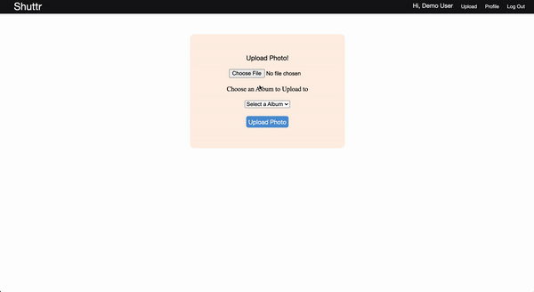
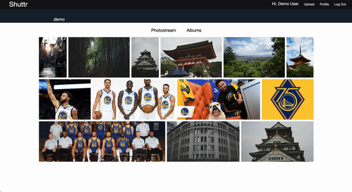
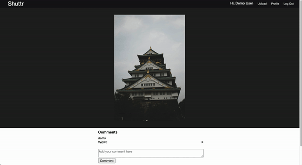

[live link](https://shuttr-1.herokuapp.com/#/)

# Shuttr

Shuttr is a full-stack web application that is a inspired by Flickr. Users can share and view photos. This application allows users to create albums, upload photos to those albums, make comments on photos, create tags on photos, and explore other user's photos as well.

# Technologies Used
* Ruby on Rails
* PostgreSQL
* React.js
* Redux
* jQuery
* SCSS
* Amazon's S3

# Features

## User Authentication
Users can create an account that will allow them to use different features of the Shuttr web application. If users already have an account they can log back in with their credentials. Error messages will populate on the screen if any of their input fields do not meet the requirements.

## Photos

### Uploading Photos
Users can add photos to their photostream or add photos to their album via the `Upload` button. Users can upload any number of photos they like to an album they created. Once an image is uploaded via the `Upload` button, they will be redirected the that photo's show page where just that photo is displayed.

### Uploading Photos to Album
Users can add photos to albums using the `Upload` button as well. There is a drop down menu in which they can select albums they have already created and would like the photo they are currently uploading to be placed in there. Photos and Albums are connected with a join association between `albums` and `photos` in a `joins_table` called `album_photos`.

### Viewing a Photo
Albums belong to a `user` and can hold many `photos`. Users will be able to view a gallery of photos via the `Explore Page`, `Photostream Page`, or `Album Page`. If a photo is clicked, they will be brought to that photo's show page where the photo is individually displayed and users can make comments.

(insert clipping of clicking through explore and profile > then clicking a photo to show Show Page)

## Albums

### Creating an Albums
Users can create and album by clicking the `Profile` button on the top right. Then click the `Albums` button on the profile nav bar which will take the user to a page with all the user's albums. Then click the `Create New Album` for the create new album form.

## Comments

### Comments
Comments belong to a `user` and a `photo`. Each photo will have a comments section below the image on it's Photo Show Page when the photo is clicked on. Comments can only be deleted by the `user` who created it. Other users will not be able to see the `delete icon` next to comments that are not thiers.

